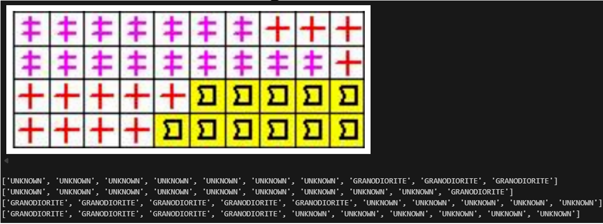
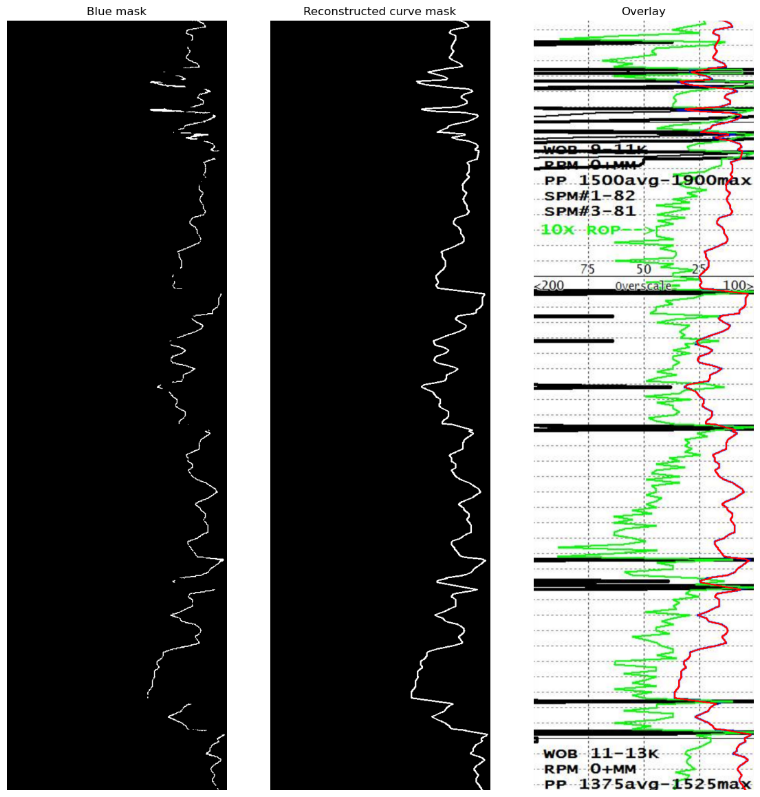
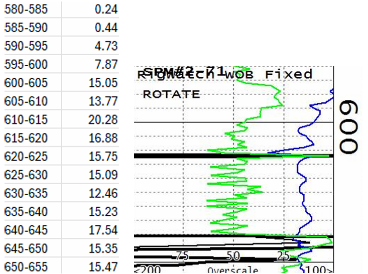

# Geological Drilling Report Parsing using Computer Vision

A comprehensive computer vision pipeline for automatically extracting **lithology** (rock composition) and **drill-rate** (Weight On Bit) data from non-structured, scanned geothermal drilling reports. 

---

## 📌 Overview

In the oil, gas, and geothermal energy sectors, vast amounts of historical and operational data are locked inside image-based PDF reports. These files are inaccessible to modern machine learning models without manual data entry. 

This project solves this by using classical computer vision techniques, color-space analysis, and rule-based morphological operations to parse complex, noisy drilling charts into structured, machine-readable `.csv` datasets.

The system specifically extracts:
1. **Lithology Tables:** Translating visual rock composition symbols into percentage-based numerical data.
2. **Drill-Rate Curves:** Reconstructing and digitizing the continuous "Weight On Bit" plot.

*Note: For confidentiality and proprietary reasons, the original drilling reports are not included in this repository. You must provide your own scanned reports to run the pipeline.*

---

## ⚙️ Architecture & Pipeline

### Step 1: Preprocessing & Document Stitching
Many computer vision techniques fail when tables span across multiple PDF pages. To counter this, the pipeline first converts high-resolution (300 dpi) PDF pages into independent images. It identifies the widest page to establish a baseline width, aligns all pages, and vertically stitches them into a single, continuous image canvas. 

### Step 2: Table Segmentation & Parameter Tuning
The algorithm converts the continuous image to grayscale and applies inverse thresholding to highlight the black structural lines of the table. 

A custom boundary detection function (`find_next_line_boundaries`) is deployed to locate horizontal and vertical dividers. **Figure 1** below demonstrates the initial detection phase, where early detection errors (highlighted by green lines) were analyzed. These errors were crucial for tuning the algorithm's threshold parameters, allowing the model to accurately differentiate between actual structural column boundaries and internal text/noise.

<div align="center">
  
  <p><b>Figure 1:</b> Initial boundary detection phase. Green lines indicate early parameter testing used to fine-tune the separation of the Drill Rate and Lithology columns from the main headers.</p>
</div>

### Step 3: Lithology Grid Formation
Once the Lithology column is isolated, the horizontal and vertical boundaries are used to reconstruct the cellular grid. Every horizontal line denotes a 5-meter depth interval. The space between is divided into 10 distinct cells, where each cell represents exactly 10% of the rock composition at that specific depth.

<div align="center">
  
  <p><b>Figure 2:</b> Red lines indicate the algorithm successfully slicing the column into a 10-cell grid per row.</p>
</div>

### Step 4: Rule-Based Symbol Classification
Instead of using heavy, data-hungry deep learning models, this pipeline utilizes a highly efficient, explainable rule-based system relying on **HSV Color Spaces** and **Morphological Operations**.

1. **Background Color Detection:** * The model averages the Hue, Saturation, and Value (HSV) of each cell. 
   * *Black* is identified by low Value (V < 60). *Yellow* is identified by Hue boundaries [15, 40] with high saturation. *White* is identified by low saturation and high value.
2. **Foreground Extraction:**
   * Based on the background, the foreground is isolated using specific inverse or Otsu thresholding techniques to preserve the integrity of the drawn lines.
3. **Structural Feature Extraction (`max_line_transitions`):**
   * A 3x3 morphological closing kernel is applied to clean noise. The model then counts the binary area (pixel density) and the `max_line_transitions` (the number of times pixel values flip between 0 and 1 horizontally or vertically). 
   * **Example:** A yellow background with a small pixel area is classified as `SAND`. A yellow background with exactly 4 vertical transitions is classified as `CONGLOMERATE`. A white background with blue lines and 2 vertical transitions is `MONZONITE`.

#### Robustness Against Unseen Data
If a symbol is heavily distorted by printing noise or falls outside the predefined geological classes, the model flags it as `UNKNOWN`. This strict rule-based logic prevents the dangerous misclassification of out-of-distribution patterns.

<div align="center">
  
  <p><b>Figure 3:</b> The model successfully classifying cells and safely labeling unrecognizable anomalies as UNKNOWN.</p>
</div>

### Step 5: Drill Rate Curve Isolation & Reconstruction
The drill rate (Weight on Bit) is represented by a fluctuating blue curve. 
1. **Blue Masking:** The image is split into RGB channels, and a strict threshold (`B > 120`, `R < 50`, `G < 50`) isolates the blue pixels.
2. **Median Filtering:** To handle thick lines and reduce noise, the median horizontal coordinate of the blue pixels is calculated for every row (depth).
3. **Linear Interpolation:** The chart is frequently obscured by black text, axis markers, or intersecting curves. When the blue line disappears, the row is marked as `NaN`. A linear interpolation algorithm seamlessly bridges these gaps to reconstruct the true trajectory of the curve.

<div align="center">
  
  <p><b>Figure 4:</b> Left: Raw, broken blue pixel mask. Middle: Reconstructed mask via interpolation. Right: The final digital curve (red) perfectly tracking the underlying plot.</p>
</div>

### Step 6: Depth Scaling and Output
To tie the X/Y coordinates back to physical reality, the model dynamically detects the green dashed horizontal lines in the background of the chart. By calculating the pixel distance between these lines, the algorithm establishes the exact pixel-to-meter scale factor. The X-axis displacement is then normalized to a standard 0–100 scale.

<div align="center">
  
  <p><b>Figure 5:</b> Final structured output showing the calculated drill rate strictly mapped to standardized depth intervals.</p>
</div>

---

## 📁 Output Files

Execution of the pipeline yields two ready-to-use CSV files:

| File | Description |
| :--- | :--- |
| `Lithology.csv` | Mapped depth intervals containing 10 columns of percentage-based rock compositions. |
| `drill_rate.csv` | Continuous, interpolated drill-rate numerical values mapped per depth row. |

---

## 🚀 Installation & Usage

1. Clone the repository to your local machine:
   ```bash
   git clone [https://github.com/YourUsername/geological-drilling-parser.git](https://github.com/YourUsername/geological-drilling-parser.git)