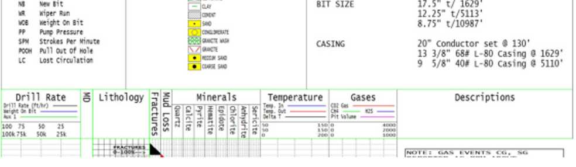
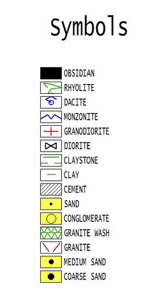

# Geological Drilling Report Parsing using Computer Vision

[](https://www.python.org/downloads/)
[](https://opencv.org/)
[](https://jupyter.org/)
[]()
[]()

A comprehensive computer vision pipeline for automatically extracting **lithology** (rock composition) and **drill-rate** (Weight On Bit) data from non-structured, scanned geothermal drilling reports. 

---

## 📌 Overview

In the oil, gas, and geothermal energy sectors, vast amounts of historical and operational data are locked inside image-based PDF reports. These files are inaccessible to modern machine learning models without manual data entry. 

This project solves this by using classical computer vision techniques, color-space analysis, and rule-based morphological operations to parse complex, noisy drilling charts into structured, machine-readable `.csv` datasets.

The system specifically extracts:
1. **Lithology Tables:** Translating visual rock composition symbols into percentage-based numerical data.
2. **Drill-Rate Curves:** Reconstructing and digitizing the continuous "Weight On Bit" plot.

*Note: For confidentiality and proprietary reasons, the original drilling reports are not included in this repository. You must provide your own scanned reports to run the pipeline.*

<div align="center">
  
  <p><b>Figure 1:</b> Example section of the raw geothermal drilling report structure.</p>
</div>

---

## ⚙️ Architecture & Pipeline

### Step 1: Document Parsing & Segmentation
The pipeline converts high-resolution PDF pages into continuous images. It then converts the image to grayscale and applies inverse thresholding to highlight the black structural lines. 

A custom boundary detection algorithm (`find_next_line_boundaries`) locates horizontal and vertical dividers. Early detection tuning (shown below) allowed the model to accurately differentiate between actual structural boundaries and internal text/noise.

<div align="center">
  
  <p><b>Figure 2:</b> Boundary detection phase. Green lines indicate early parameter tuning to separate columns.</p>
</div>

### Step 2: Lithology Grid Formation
Once the Lithology column is isolated, boundaries are used to reconstruct the cellular grid. Every horizontal line denotes a 5-meter depth interval. The row is divided into 10 distinct cells, where each cell represents exactly 10% of the rock composition at that specific depth.

<div align="center">
  
  <p><b>Figure 3:</b> Red lines indicate the algorithm successfully slicing the column into a 10-cell grid per row.</p>
</div>

### Step 3: Lithology Dictionary & Classification Rules
Instead of using heavy, data-hungry deep learning models, this pipeline utilizes a highly efficient rule-based dictionary relying on **HSV Color Spaces** and **Morphological Operations** (`max_line_transitions` and `binary_area`).

<div align="center">
  
  <p><b>Figure 4:</b> The reference legend used to map visual symbols to geological classes.</p>
</div>

The classification dictionary follows a strict decision tree:

* **⬛ Black Background:** Directly classified as `OBSIDIAN`.
* **🟨 Yellow Background:**
    * *2 Vertical Transitions:* Differentiated by pixel area (`< 80` = `SAND`, `< 150` = `MEDIUM SAND`, else = `COARSE SAND`).
    * *4 Vertical Transitions:* Classified as `CONGLOMERATE`.
* **⬜ White Background (Analyzed by Foreground Line Color):**
    * **Black Lines:** `0` horizontal transitions in the top section = `DIORITE`, else = `CEMENT`.
    * **Blue Lines:** `2` vertical transitions = `MONZONITE`, else = `DACITE`.
    * **Red Lines:** `2` horizontal transitions = `GRANODIORITE`, else = `GRANITE`.
    * **Green Lines:** `< 4` horizontal transitions (separated into `CLAY` and `CLAYSTONE` based on vertical transitions). `4` horizontal transitions = `RHYOLITE`, else = `GRANITE WASH`.

### Step 4: Handling Unseen Symbols & Noise
If a symbol is heavily distorted by printing noise or falls outside the predefined dictionary rules, the model flags it as `UNKNOWN`. This strict logic prevents the dangerous misclassification of out-of-distribution patterns.

<div align="center">
  
  <p><b>Figure 5:</b> The model successfully classifying cells and safely labeling unrecognizable anomalies as UNKNOWN.</p>
</div>

### Step 5: Drill Rate Curve Isolation & Reconstruction
The drill rate (Weight on Bit) is represented by a fluctuating blue curve. 
1. **Blue Masking:** The image is split into RGB channels, and a strict threshold (`B > 120`, `R < 50`, `G < 50`) isolates the blue pixels.
2. **Median Filtering:** To handle thick lines and reduce noise, the median horizontal coordinate is calculated for every row (depth).
3. **Linear Interpolation:** The chart is frequently obscured by black text or intersecting curves. When the blue line disappears, the row is marked as `NaN`. A linear interpolation algorithm seamlessly bridges these gaps to reconstruct the true trajectory.

<div align="center">
  
  <p><b>Figure 6:</b> Left: Raw blue pixel mask. Middle: Reconstructed mask via interpolation. Right: The final digital curve perfectly tracking the underlying plot.</p>
</div>

### Step 6: Depth Scaling and Output
To tie the X/Y coordinates back to physical reality, the model dynamically detects the green dashed horizontal lines in the background of the chart. By calculating the pixel distance between these lines, the algorithm establishes the exact pixel-to-meter scale factor. The X-axis drill rate is then mapped and normalized.

<div align="center">
  
  <p><b>Figure 7:</b> Final structured output showing the calculated drill rate strictly mapped to depth intervals.</p>
</div>

---

## 📁 Output Data Structure

Execution of the pipeline yields two ready-to-use CSV files:

| File | Description |
| :--- | :--- |
| `Lithology.csv` | Depth intervals mapped to percentage-based rock compositions (e.g., 20% Sand, 80% Granite). Includes the `UNKNOWN` category. |
| `Drill_Rate.csv` | Continuous, interpolated drill-rate numerical values mapped per depth row on a 0-100 scale. |

---

## 🚀 Requirements & Installation

1. Clone the repository to your local machine.
2. Install the required system dependencies (required for PDF processing):
   * Linux: `sudo apt-get install poppler-utils`
   * Windows: Download and configure Poppler binaries.
3. Install the Python dependencies:
   ```bash
   pip install -r requirements.txt